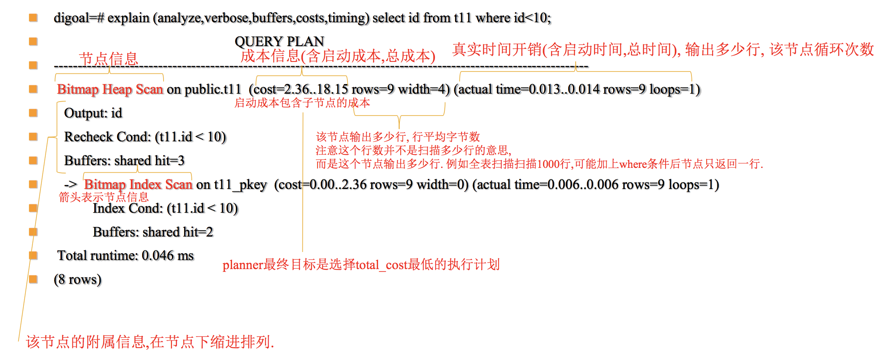

#### 读懂执行计划


- ```actual_cost = startup_cost + (total_cost - startup_cost) * tuples_to_fetch / path->rows;```

#### SQL执行包含的几个部分
- 关联节点
- 聚合节点
- 排序节点
- 返回行信息

#### 各类执行原子说明
##### 表连接方式
- ```Nested loop``` : 根据左表查询到的行作为游标查询的条件一次输出查询结果（适合游标的关联列发生在唯一索引上的场景）。
- ```Hash Join``` : 首先右表扫描加载到HASH表中，hash key为JOIN列。然后左表扫描，并与内存中的hash表进行关联，输出最终结果。  
- ```Merge Join``` : 首先两个JOIN的表根据join key进行排序。然后根据join key的排序顺序并行扫描两个表进行匹配输出最终结果。这种方式适合大表并且索引列进行关联的情况。  


##### 表扫描方式
走顺序还是走索引，是根据成本计算后选择的，任何一种表连接方式都可能会选择任意一种扫描方式。  
index--bitmap--seq  

- ```Seq Scan``` : 从堆直接输出heap tuple
- Sample Scan
- ```Index Scan``` : 扫描索引，找到后，通过索引找到heap上tuple，然后返回
- ```Index Only Scan``` : 扫描索引，找到后，直接返回（前提：数据都在索引上）
- ```Bitmap Index Scan``` : 从索引输出索引条目（包含heap_page_id),上层节点按照heap_page_id排序后获取heap_tuple。这样可以降低随机读。
- ```Bitmap Heap Scan``` : 从heap找到条目，排序后获取，可以降低随机读。
- Tid Scan
- Subquery Scan
- Function Scan
- Values Scan
- Foreign Scan

##### 其他
- Recursive Union
- Append
- Merge Append
- ```Materialize``` ： 将中间结果物化，使用的是work_mem，不够存放时会用到磁盘(嵌套循环的内部表是否采用物化方式减少扫描成本)
- Sort
- Group
- Unique
- Limit
- Hash
- Aggregate
- GroupAggregate
- HashAggregate

#### 具体执行优劣说明
- Heap Fetchs : 有vm和没有vm这个消耗的差异是很大的  
- Index only scan在没有vm文件的情况下比Index scan要慢，因为要扫描所有的Heap page。

#### 说明
1. 索引列关联查询应该走merge join，如果出现nested loop或hash join需要具体分析。
2. 一个类似WHERE x = 42 OR x = 47 OR x = 53 OR x = 99 这样的查询可以分解成四个在x上的独立扫描，每个扫描使用一个条件， 最后将这些扫描的结果 OR 在一起，生成最终结果。（为了组合多个索引，系统扫描每个需要的索引，然后在内存里组织一个位图， 它给出索引扫描报告符合索引条件的表数据行的位置。然后，根据查询的需要， 把这个位图使用 AND 和 OR 合并在一起。最后，访问实际的表检索并返回数据行。 表的数据行是按照物理顺序进行访问的，因为那就是位图的布局； 这就意味着任何原来的索引排序都将消失，而如果查询有一个ORDER BY子句， 那么还会有一个额外的排序步骤。）
