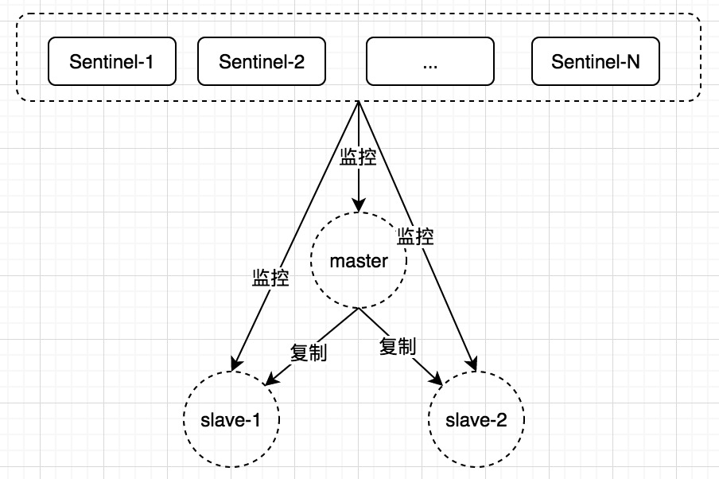

### 1.复制
#### 1.1.使用
- 从节点可以使用```slave-read-only=yes```配置为只读模式

##### 1.1.1.建立复制
- 方法一：在配置文件中加入```slaveof {masterHost} {masterPort}```
- 方式二：启动命令后加入```--slaveof slaveof {masterHost} {masterPort}```
- 方式三：直接使用命令： ```slaveof {masterHost} {masterPort}```  

**上述操作都在从节点处理**  
**重复执行```slaveof {masterHost} {masterPort}```会切断与原主节点的复制关系，与新节点创建复制关系**

##### 1.1.2.断开复制
```slaveof no one```
- 断开复制关系后，从节点会晋升为主节点

#### 1.2.原理

##### 1.2.1.首次建立复制的过程
- 从节点保存主节点信息
- 主从建立socket连接（从节点每秒定时扫描保存的主节点信息，有新的就创建）
	- 无法连接成功，会无限重试直到成功或直到执行断开复制的命令。 
- 从节点向主节点发送ping命令开始首次通信。
- 主节点进行权限验证（比如验证密码）
- 主节点将所有数据都发送给从节点（这个过程会执行RDB文件持久化这个动作）
- 命令持续复制

##### 1.2.2.全量复制
- 初次复制时使用
- ```psync ? -1```强制出发全量复制。
- 全量复制过程包含主节点RDB持久化和RDB文件传输给从节点的过程。
- Redis支持无盘复制，即RDB文件不保存到硬盘而是直接通过网络发送给从节点，是通过```repl-diskless-sync```参数控制的，默认关闭。
- 主节点生成RDB文件到从节点加载完RDB文件，有一段时间间隔，这段时间产生的写命令会保存在一个缓冲区中。默认配置为```client-output-buffer-limit slave 256MB 64MB 60```，如果60秒内缓冲区消耗持续大于64MB或者直接超过256MB，主节点直接关闭复制客户端连接，全量同步失败。
- 从节点清空自身数据是在接收完RDB文件后。清空数据也比较耗时。

##### 1.2.3.部分复制
- 用于处理网络闪断、备机短时重启等场景。
- 复制积压缓冲区默认大小1MB。
- 从节点连上主节点后，如果条件允许，主节点补发丢失的数据给从节点。
	- 条件允许包括判断如下信息：主从节点各自的复制偏移量、主节点的复制积压缓冲区、主节点的运行ID
	- 运行ID是一个40位的十六进制字符串，Redis关闭再启动后，运行ID会随之改变。```debug reload```不会改变运行ID。

- ```psync {runId} {offset}```，runid是从节点要复制的主节点的运行ID，offset是从节点当前复制偏移量。优先使用部分复制，如果无法使用部分复制，则使用全量复制。
 
##### 1.2.5.心跳
- 主节点默认每10秒向从节点发送PING命令。可以通过```repl-ping-slave-period```控制频率
- 从节点在主线程中每隔1秒发送```replconf ack {offset}```命令，给主节点上报自身当前的复制偏移量。

#### 1.3.注意事项
- 主节点的变更会无条件同步到从节点，例如主上清空数据，从上也会清空数据，要注意在实际应用中的影响，特别是主故障，主重启等异常场景。
- 全量复制时间超过```repl-timeout```所配置的值会导致复制失败。默认是60秒。
- 复制相关的关键互斥资源：网络，硬盘

#### 1.4.小技巧
#####  ```info replication```查看复制相关状态，包括角色、IP、复制偏移量等信息
```
127.0.0.1:6379> info replication
# Replication
role:master
connected_slaves:1
slave0:ip=127.0.0.1,port=6378,state=online,offset=3137,lag=0
master_repl_offset:3137
repl_backlog_active:1
repl_backlog_size:1048576
repl_backlog_first_byte_offset:2
repl_backlog_histlen:3136

127.0.0.1:6378> info replication
# Replication
role:slave
master_host:127.0.0.1
master_port:6379
master_link_status:up
master_last_io_seconds_ago:10
master_sync_in_progress:0
slave_repl_offset:3151
slave_priority:100
slave_read_only:1
connected_slaves:0
master_repl_offset:0
repl_backlog_active:0
repl_backlog_size:1048576
repl_backlog_first_byte_offset:0
repl_backlog_histlen:0
```
#### ```client list```查看客户端信息，关注flag字段
```
127.0.0.1:6379> client list
id=8 addr=127.0.0.1:51417 fd=5 name= age=13504 idle=0 flags=N db=0 sub=0 psub=0 multi=-1 qbuf=0 qbuf-free=32768 obl=0 oll=0 omem=0 events=r cmd=client
id=9 addr=127.0.0.1:52941 fd=6 name= age=2313 idle=1 flags=S db=0 sub=0 psub=0 multi=-1 qbuf=0 qbuf-free=0 obl=0 oll=0 omem=0 events=r cmd=replconf
id=10 addr=127.0.0.1:52977 fd=7 name= age=444 idle=444 flags=N db=0 sub=0 psub=0 multi=-1 qbuf=0 qbuf-free=0 obl=0 oll=0 omem=0 events=r cmd=command
127.0.0.1:6379>
```

### 2.哨兵-Redis的高可用实现方案
提供了什么能力：故障发现、switchover、failover（一主一从、一主多从，多从场景更复杂一些，包括如何选举新的主节点）和将变更通知给应用方


#### 2.1.Redis Sentinel概要


- 是一个分布式架构，包含**若干**Sentinel节点和Redis数据节点（主从节点）
- 在Redis Sentinel结构中，客户端在初始化时连接的是Sentinel节点集合，从中获取主节点信息。

#### 2.2.基本原理
##### 三个监控任务
- 每隔10秒，每个Sentinel节点会向主节点和从节点发送info命令获取最新的拓扑结构。
	- 主节点的info信息中包含了从节点的信息，因此不需要显示配置从节点，且新的从节点增加进来后可以自动发现。
- 每隔2秒，每个Sentinel节点会向Redis数据节点（主从）的```__sentinel__:hello```频道上发送该Sentinel节点对于主节点的判断以及当前sentinel节点的信息。同时每个sentinel节点也会订阅该频道来了解其他sentinel节点以及它们对主节点的判断。
	- 可以用来发现新加入的sentinel节点
	- 交换主节点的状态
- 每隔1秒，每个Sentinel节点会向主节点、从节点、其余Sentinel节点发送一条ping命令，用来当做心跳检测。

##### 如何判断一个节点是否故障了
- 节点超过```down-after-milliseconds```没有进行有效回复。存在误判的可能，因为只是自己这个sentinel节点的判断。
- 当认为主节点故障时，会向其他sentinel节点发送```sentinel is-master-down-by-addr```命令来询问对方对主节点的判断，当超过quorum个sentinel节点认为主节点确实有问题，就认为主节点确认有问题了。

##### 领导者Sentinel节点选举算法
领导者节点含义：用来完成实际的故障转移工作，使用Raft算法实现领导者选举。大致思路：

- 向其他Sentinel发送自己希望成为领导者的请求。
- 其他节点同意或拒绝。  （如果没有同意过其他节点成为领导者的请求，就同意当前请求，否则拒绝）
- 如果自己的票数已经大于max(quorum, num(sentinels)/2+1)，则成为领导者。
- 如果没有选举出领导者，则重复这个过程。

##### 故障转移--如何选出新的主节点
- 过滤不健康（主观下线、一定时间内没有回复响应、失联的节点）的从节点。
- 选择slave-priority最高的从节点列表。
- 选择复制偏移量最大的从节点（复制的最完整）。
- 选择runid最小的从节点。

#### 2.3.命令介绍
##### sentinel is-master-down-by-addr <ip> <port> <current_epoch> <runid>
- 当runid为*时，用了交换对主节点下线的判断
- 当runid为当前Sentienl节点的runid时，作用是当前sentinel节点希望目标sentinel节点同意自己成为领导者的请求。

#### 2.4.安装部署
1. 先启动一个主节点，两个从节点
2. 部署sentienl节点  
	- 配置文件（不同节点间只要端口号不同即可）  

```
$ cat redis-sentinel-26379.conf
port 26379
daemonize yes
logfile /Users/shiguangsheng/user_program/redis_sentinel/sentinel_26379.log
dir /Users/shiguangsheng/user_program/redis_sentinel/data
#2代表主节点失败至少需要2个sentinel节点同意
sentinel monitor mymaster 127.0.0.1 6379 2
sentinel down-after-milliseconds mymaster 30000
sentinel parallel-syncs mymaster 1
sentinel failover-timeout mymaster 180000
```
   - 启动

```
方法一：
redis-sentinel redis-sentinel-26379.conf
方法二：
redis-server redis-sentinel-26378.conf --sentinel
```
	- 确认
```
$ redis-cli -p 26379 info Sentinel
# Sentinel
sentinel_masters:1
sentinel_tilt:0
sentinel_running_scripts:0
sentinel_scripts_queue_length:0
sentinel_simulate_failure_flags:0
master0:name=mymaster,status=ok,address=127.0.0.1:6379,slaves=2,sentinels=3
```

#### 2.5.节点故障测试
```
#当前redis相关进程

$ ps -ef |grep redis |grep -v grep
  501  3584     1   0  8:28上午 ??         0:22.63 redis-server 127.0.0.1:6379
  501  3888     1   0 10:59上午 ??         0:15.97 redis-server 127.0.0.1:6378
  501  4350     1   0  5:44下午 ??         0:07.29 redis-server 127.0.0.1:6377
  501  4395     1   0  5:55下午 ??         0:10.66 redis-sentinel *:26379 [sentinel]
  501  4420     1   0  5:59下午 ??         0:10.47 redis-server *:26378 [sentinel]
  501  4422     1   0  6:00下午 ??         0:10.22 redis-sentinel *:26377 [sentinel]
$ redis-cli -p 26379 info Sentinel
# Sentinel
sentinel_masters:1
sentinel_tilt:0
sentinel_running_scripts:0
sentinel_scripts_queue_length:0
sentinel_simulate_failure_flags:0
master0:name=mymaster,status=ok,address=127.0.0.1:6379,slaves=2,sentinels=3
$ redis-cli info replication
# Replication
role:master
connected_slaves:2
slave0:ip=127.0.0.1,port=6377,state=online,offset=1035728,lag=0
slave1:ip=127.0.0.1,port=6378,state=online,offset=1035728,lag=0
master_repl_offset:1035728
repl_backlog_active:1
repl_backlog_size:1048576
repl_backlog_first_byte_offset:2
repl_backlog_histlen:1035727

#杀掉主进程
#查看信息
$ redis-cli -p 6378 info replication
# Replication
role:master
connected_slaves:1
slave0:ip=127.0.0.1,port=6377,state=online,offset=19715,lag=1
master_repl_offset:19848
repl_backlog_active:1
repl_backlog_size:1048576
repl_backlog_first_byte_offset:2
repl_backlog_histlen:19847

#拉起被杀掉的redis数据节点
$ redis-cli -p 6378 info replication
# Replication
role:master
connected_slaves:2
slave0:ip=127.0.0.1,port=6377,state=online,offset=32723,lag=1
slave1:ip=127.0.0.1,port=6379,state=online,offset=32989,lag=1
master_repl_offset:32989
repl_backlog_active:1
repl_backlog_size:1048576
repl_backlog_first_byte_offset:2
repl_backlog_histlen:32988
```

#### 2.6.配置项说明
- ```sentinel monitor <master-name> <ip> <port> <quorum>```
	- quorum : 判定主节点不可达所需要的票数，建议配置值: sentinel个数/2+1 
	- 配置多个master-name就可以实现一个sentienl监控多个redis数据主节点。
- ```sentinel down-after-milliseconds <master-name> <times>```
	- 超过这个时间则判定节点不可达，单位毫秒
- ```sentinel parallel-syncs <master-name> <nums>```
	- 用来限制一次故障转移后，每次向新节点发起复制操作的从节点个数。 
- ```sentinel failover-timeout```
	- 如果sentienl对一个主节点故障转移失败，那么下次再对该节点做故障转移的起始时间是failover-timeout的两倍。
- ```sentinel auth-pass```
	- 用于添加监控的数据主节点的密码
- ```sentinel notification-script <master-name> <script-path>```
	- 在故障期间，当一些警告级别的故障产生时，会触发对应路径的脚本，并向脚本发送相应的事件参数。
- ```sentinel client-reconfig-script <master-name> <script-path>```
	- 故障转移结束后，触发对应路径的脚本，并向脚本发送故障转移结果的相关参数。

#### 2.7.API
1. sentinel masters : 展示所有被监控的主节点状态和相关的统计信息
2. sentinel master <master-name> : 展示指定的主节点状态和相关的统计信息
3. sentinel slaves <master-name> : 展示指定的从节点状态及相关统计信息
4. sentinel sentinels <master-name> :  展示指定master-name的sentinel节点集合（不包含当前sentine节点）
5. sentinel get-master-addr-by-name <master-name> : 获取指定主节点的IP和PORT
6. sentinel reset <pattern> :  对指定节点的配置进行重置，包括清除主节点的相关状态，重新发现从节点和sentinel节点
7. sentinel failover <master-name> : 对指定的主节点进行强制故障转移
8. sentinel ckquorum <master-name>
9. sentinel flushconfig : 将配置强制刷新到磁盘上
10. sentinel remove <master-name>
11. sentinel monitor <master-name> <ip> <port> <quorum>
12. sentinel set <master-name> : 动态修改配置选项
13. sentinel is-master-down-by-addr : sentinel节点之间用来交换对主节点是否下线的判断

#### 客户端连接
- 如果需要正确的连接Redis Sentinel，必须有Sentinel节点集合和masterName两个参数。
- 客户端要自己实现发现Redis数据主节点的功能，并定时监控，以便在故障切换后快速发现新的主节点信息。
- 发现主节点后，最好做次验证。