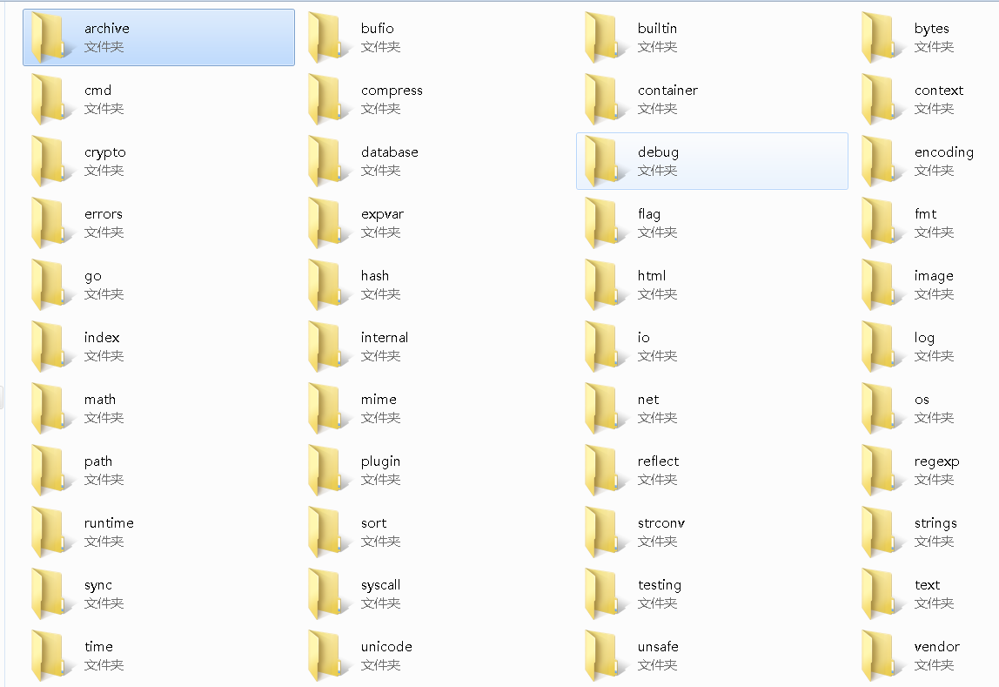

### 标准库（go安装目录的src目录下有源码）


### 日志
#### 标准库 log.go 代码
``` log.SetFlags
const (
	// Bits or'ed together to control what's printed.
	// There is no control over the order they appear (the order listed
	// here) or the format they present (as described in the comments).
	// The prefix is followed by a colon only when Llongfile or Lshortfile
	// is specified.
	// For example, flags Ldate | Ltime (or LstdFlags) produce,
	//	2009/01/23 01:23:23 message
	// while flags Ldate | Ltime | Lmicroseconds | Llongfile produce,
	//	2009/01/23 01:23:23.123123 /a/b/c/d.go:23: message
	Ldate         = 1 << iota     // the date in the local time zone: 2009/01/23
	Ltime                         // the time in the local time zone: 01:23:23
	Lmicroseconds                 // microsecond resolution: 01:23:23.123123.  assumes Ltime.
	Llongfile                     // full file name and line number: /a/b/c/d.go:23
	Lshortfile                    // final file name element and line number: d.go:23. overrides Llongfile
	LUTC                          // if Ldate or Ltime is set, use UTC rather than the local time zone
	LstdFlags     = Ldate | Ltime // initial values for the standard logger
)
// A Logger represents an active logging object that generates lines of
// output to an io.Writer. Each logging operation makes a single call to
// the Writer's Write method. A Logger can be used simultaneously from
// multiple goroutines; it guarantees to serialize access to the Writer.
type Logger struct {
	mu     sync.Mutex // ensures atomic writes; protects the following fields
	prefix string     // prefix to write at beginning of each line
	flag   int        // properties
	out    io.Writer  // destination for output
	buf    []byte     // for accumulating text to write
}
```
#### 关键字iota
这个关键字让编译器为每个常量复制相同的表达式，直到声明区结束或遇到一个新的赋值语句。  
且  
iota的初始值为0，之后iota的值在每次处理为常量后，都会自增1.比如上面的代码相当于
```
   Ldate = 1 << 0
   Ltime = 1 << 1
   Lmicroseconds = 1 << 2
   ...
   LUTC = 1 << 5
```

#### 定制日志记录器
标准库函数
```
func New(out io.Writer, prefix string, flag int) *Logger {
	return &Logger{out: out, prefix: prefix, flag: flag}
}
```
示例
```
var (
	Trace   *log.Logger // Just about anything
	Info    *log.Logger // Important information
	Warning *log.Logger // Be concerned
	Error   *log.Logger // Critical problem
)

func init() {
	file, err := os.OpenFile("errors.txt",
		os.O_CREATE|os.O_WRONLY|os.O_APPEND, 0666)
	if err != nil {
		log.Fatalln("Failed to open error log file:", err)
	}

	Trace = log.New(ioutil.Discard,
		"TRACE: ",
		log.Ldate|log.Ltime|log.Lshortfile)

	Info = log.New(os.Stdout,
		"INFO: ",
		log.Ldate|log.Ltime|log.Lshortfile)

	Warning = log.New(os.Stdout,
		"WARNING: ",
		log.Ldate|log.Ltime|log.Lshortfile)

	Error = log.New(io.MultiWriter(file, os.Stderr),
		"ERROR: ",
		log.Ldate|log.Ltime|log.Lshortfile)
}
```

#### 其他说明
1. Fatal系列函数打印日志后会使用os.Exit(1)来终止程序
2. Panic系列函数打印日志后会触发一个panic，除非程序执行recover函数，否则会导致程序打印调用栈后终止。
3. log提供的日志记录器时多goroutine安全的。

### 编解码JSON
1. json相对xml的优势： JSON需要处理的标签更少，也就意味着网络传输时每个消息的数据更少。

#### JSON文件和Go结构体对应
JSON文件
```
{
    "responseData"{
        "results": [
            {
                "GsearchResultClass": "abc",
                "unescapedUrl": "https://www.baidu.com",
                "url" : "https://www.baidu.com"
            },
            {
                "GsearchResultClass": "bcd",
                "unescapedUrl": "https://www.sina.com",
                "url" : "https://www.sina.com"
            }
        ]
    }
}
```
go结构体
```
type (
	// gResult maps to the result document received from the search.
	gResult struct {
		GsearchResultClass string `json:"GsearchResultClass"`
		UnescapedURL       string `json:"unescapedUrl"`
		URL                string `json:"url"`
	}

	// gResponse contains the top level document.
	gResponse struct {
		ResponseData struct {
			Results []gResult `json:"results"`
		} `json:"responseData"`
	}
)
```
**每个字段最后都用`号声明了一个字符串，这些字符串被称作tag，是提供每个字段元信息的一种机制，将JSON文档和结构里的每个字段意义对应起来。如果不存在标签，编码和解码会试图以大小写无关的方式，直接使用字段的名字进行匹配。如果无法匹配，对应的结构类型里的字段就包含其零值。**  
#### 对应标准库函数
```
// NewDecoder返回从r读取的解码器
// 解码器自己会进行缓冲，而且可能会从r读比解码JSON值所需更多的数据
func NewDecoder(r io.Reader) *Decoder 

// Decode 从自己的输入里读取下一个解码好的JSON值，并存入v执行的值里
func (dec *Decoder) Decode(v interface{}) error
```
##### interface{}
1. 任何类型都实现了一个空接口interface{}
2. Decode的入参是interface{}，意味着Decoe方法可以接受任意类型的值。  

#### 示例
```
package main

import (
	"encoding/json"
	"fmt"
	"log"
)

// Contact represents our JSON string.
type Contact struct {
	Name    string `json:"name"`
	Title   string `json:"title"`
	Contact struct {
		Home string `json:"home"`
		Cell string `json:"cell"`
	} `json:"contact"`
}

// JSON contains a sample string to unmarshal.
var JSON = `{
	"name": "Gopher",
	"title": "programmer",
	"contact": {
		"home": "415.333.3333",
		"cell": "415.555.5555"
	}
}`

func main() {
	// Unmarshal the JSON string into our variable.
	var c Contact
	err := json.Unmarshal([]byte(JSON), &c)
	if err != nil {
		log.Println("ERROR:", err)
		return
	}

	fmt.Println(c)
}
```


### 输入和输出
#### io.Writer
```
type Writer interface {
	Write(p []byte) (n int, err error)
}
```
Write从p里向底层的数据流写入len(p)字节的数据。这个方法返回从p里写出的字节数(0 <= n <= len(p))，以及任何可能导致写入提前结束的错误。Write在返回n < len(p)的时候必须同时返回某个非nil值的error。Write绝不能改写切片里的数据，哪怕是临时修改也不行。
#### io.Reader
```
type Reader interface {
	Read(p []byte) (n int, err error)
}
```
- Read最多读入len(p)字节数据，保存到p。这个方法返回读入的字节数（0 <= n <= len(p)）和任何读取时发生的错误。即便Read返回的n < len(p)，方法也可能使用所有p的空间存储临时数据。如果数据可以读取，但是字节长度不足len(p)，习惯上Read会立刻返回可用的数据，而不是等待更多的数据。
- 当成功读取n > 0字节后，如果遇到错误或读取完成，Read方法返回读入的字节数，方法可能会在本次调用返回一个非nil的错误，或者在下一次调用返回错误（同时n == 0）。这种情况的一个例子是，再输入的流结束时，Read的流会返回非0的字节数，可能返回err == EOF,也可能返回err = nil。无论如何，下一次调用Read应该返回0, EOF.
- 调用者在返回n > 0时，总应该先处理读入的数据再处理err，这样才能正确操作读取一部分字节后发生的I/O错误。EOF也要这样处理。
- Read的实现不鼓励返回0个字节的同时返回nil。调用者需要将这种返回状态视为没有任何操作，而不是遇到读取结束。
#### Fprintf
```
// Fprintf根据格式化输入符来格式化内容，并输出到w
// 这个函数返回写入的字节数，以及任何遇到的错误
func Fprintf(w io.Writer, format string, a ...interface{}) (n int, err error) {
	p := newPrinter()
	p.doPrintf(format, a)
	n, err = w.Write(p.buf)
	p.free()
	return
}
```