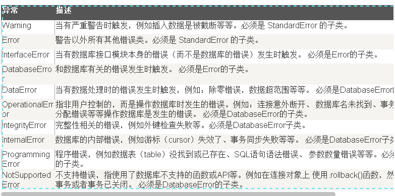

1. 安装MySQL-python(https://pypi.python.org/pypi/MySQL-python/)  
```sudo python setup.py install```

2. 创建一个测试用户
```
create user 'pythontest'@'localhost' identified by 'Python';
create database pythondb;
grant all on pythondb.* to pythontest;
```
3. Python代码（增加，删除，更新，创建表，删除表）
```
#coding=utf-8

import MySQLdb

def print_person_info(cursor):
    sql_str = "select id, name from person"
    try:
        cursor.execute(sql_str)
        results = cursor.fetchall()
        if results:
            for result_row in results:
                id = result_row[0]
                name = result_row[1]
                print("id is "+str(id)+", name is "+name)
        else:
            print("The table is empty!")
    except Exception, err:
        print("Query failed("+str(err)+")")

if __name__ == '__main__':
    try:
        #连接数据库
        conn= MySQLdb.connect(
                        host='localhost',
                        port = 3306,
                        user='pythontest',
                        passwd='Python',
                        db ='pythondb',
                            )
        cursor = conn.cursor()
        #创建表
        print("Create Table:")
        cursor.execute("drop table if exists person")
        cursor.execute("create table person(id int, name varchar(50))")
        #查询数据
        print_person_info(cursor)
        #插入一条数据
        print("Insert One Record:")
        cursor.execute("insert into person values(1, 'heyichen')")
        print_person_info(cursor)
        #更新这条数据
        print("Update One Record:")
        cursor.execute("update person set name = 'heyicheng' where id = 1")
        print_person_info(cursor)
        #删除这条数据
        print("Delete One Record:")
        cursor.execute("delete from person where id = 1")
        print_person_info(cursor)
        #插入多条数据
        print("Insert Mutl Record:")
        cursor.execute("insert into person(id, name) values (1, 'Paul Smith'), (2, 'Mic Jondan'), (3, 'Karl Lenon')")
        print_person_info(cursor)
        #释放资源
        cursor.close()
        conn.commit()
    except Exception, err:
        conn.rollback()
        print("Executed failed("+str(err)+")")
        conn.close()
```
执行结果
```
Create Table:
The table is empty!
Insert One Record:
id is 1, name is heyichen
Update One Record:
id is 1, name is heyicheng
Delete One Record:
The table is empty!
Insert Mutl Record:
id is 1, name is Paul Smith
id is 2, name is Mic Jondan
id is 3, name is Karl Lenon
```
4. 常见错误说明
错误处理
DB API中定义了一些数据库操作的错误及异常，下表列出了这些错误和异常:

